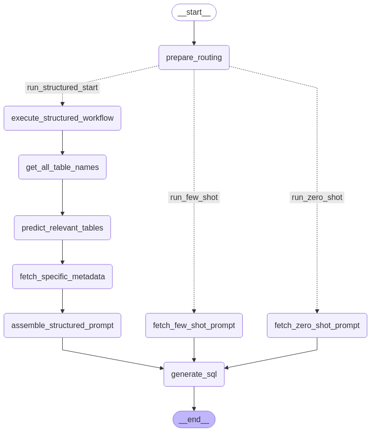
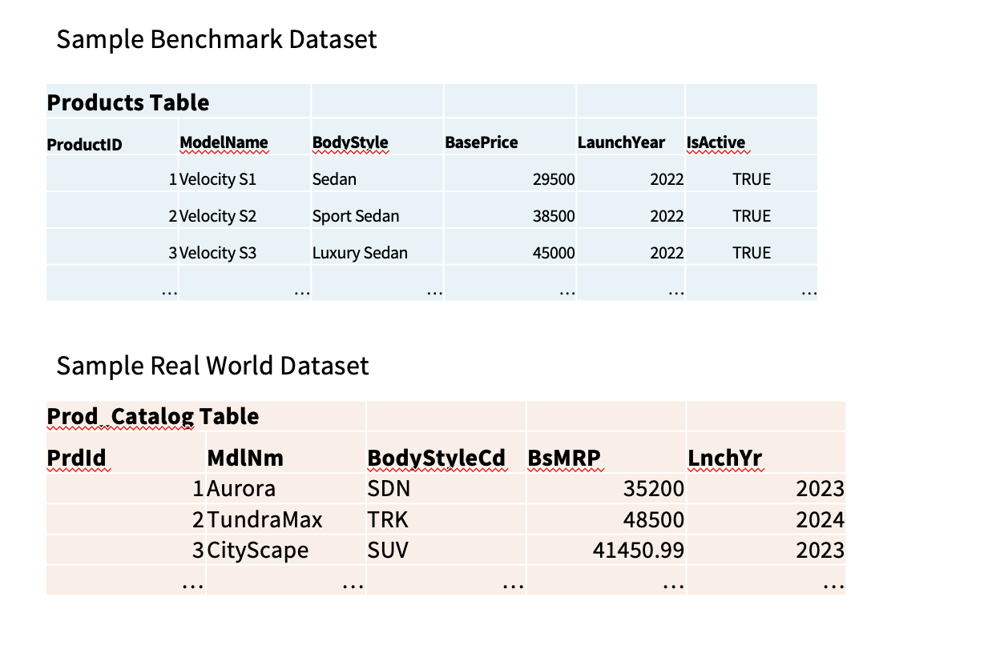
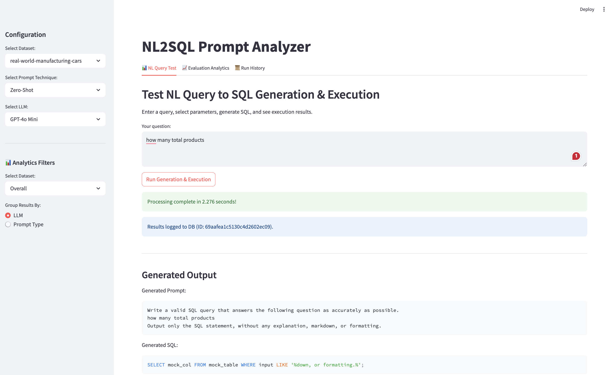
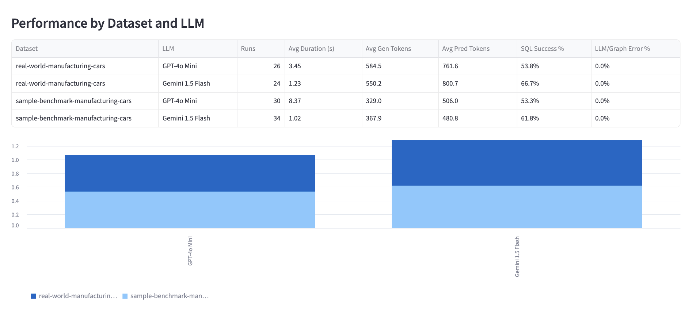
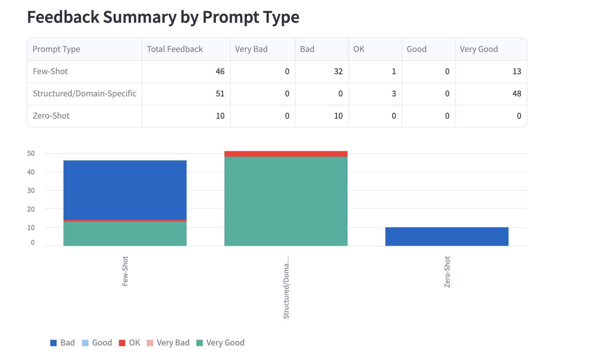

# NL2SQL Prompt Engineering Analyzer

## Description

This project is an analysis and evaluation framework designed to systematically study the impact of various prompt engineering techniques on the accuracy of SQL query generation by Large Language Models (LLMs). It focuses on the Natural Language to SQL (NL2SQL) task, by comparing model performance across standard benchmark datasets (like Spider, WikiSQL) and simulated real-world database scenarios which often feature unstructured schemas and domain-specific ambiguities.

The framework allows users to input natural language questions, apply different prompting strategies (Zero-Shot, Few-Shot, Structured/Domain-Specific), generate SQL queries using configurable LLMs (e.g., GPT, LLaMA), execute these queries, and evaluate their accuracy using metrics like Exact Match (EM) and Execution Accuracy (ExecAcc).

*(Based on the project proposal dated approx. April 2025, Fairfax, VA)*

## Objectives

* Explain how different prompt engineering techniques influence SQL query generation accuracy in NL2SQL models.
* Compare the performance of NL2SQL models on benchmark datasets versus real-world databases.
* Identify optimal prompt strategies for increasing query accuracy and model generalization.
* Provide insights into the real-world usability and robustness of NL2SQL models in practical business environments.

## Directory Structure

```
nl2sql_prompt_analyzer/
│
├── app/              # Contains the main Streamlit user interface code
│   └── main_streamlit.py # Entry point for the Streamlit application
│
├── storage/          # Handles interaction with the database (SQL)
│   └── db_handler.py       # Functions for database operations (CRUD for logs, results, etc.)
│   └── sql_connector.py       # Functions for  LLM operations for SQL Query generation
│   └── test_mongo_connection.py       # Standalone script to test MongoDB connection for NoSQL database
│
├── experiments/      # Scripts for running automated batch experiments
│   └── Google-Gemini-API.html # Sample Databricks code to assess the LLM usage
│   └── OpenAI-API.html # Sample Databricks code to assess the LLM usage
|
├── graph_logic/          # <<< NEW DIRECTORY FOR LANGGRAPH COMPONENTS
│   ├── __init__.py
│   ├── state.py          # Defines the graph state
│   ├── prompts.py        # Prompt templates/logic
│   ├── schema.py         # Schema fetching/formatting
│   ├── sql_gen.py        # Node for calling LLM to generate SQL
│   └── graph.py          # Node definitions and graph assembly
│
├── analysis/         # Jupyter notebooks or scripts for analyzing results
│   └── result_analyzer.ipynb # Example notebook for analysis
│
├── config/           # Configuration files
│   └── .env             # .env provided by the user
│   └── .env.example     # Setup example
│   ├── settings.py         # Stores API keys, DB connection strings, model params
│   └── logging_config.py   # Configures application logging
│
├── logs/             # Directory where .log files are written local logs (during development, can be removed later)
│
├── datasets/         # Placeholder for storing small datasets or schema files\
│   └── real-world-manufacturing-cars.sql   # .sql file for Real world data simulation
│   └── sample-benchmark-manufacturing-cars.sql   # .sql file for benchamrk data simulation
│
├── requirements.txt  # Project dependencies
├── README.md         # This file
└── .gitignore        # Specifies intentionally untracked files for Git
```

## Architecture (high level) using LangGraph



## Setup

1.  **Clone the repository:**
    ```bash
    git clone https://github.com/keerthanyaa/AIT614-Project-Spring2025-NL-to-SQL-Prompt-Analyzer.git
    cd nl2sql_prompt_analyzer
    ```

2.  **Create and activate a virtual environment:**
    ```bash
    # Linux/macOS
    python3 -m venv venv
    source venv/bin/activate

    # Windows (cmd)
    python -m venv venv
    venv\Scripts\activate.bat

    # Windows (PowerShell)
    python -m venv venv
    .\venv\Scripts\Activate.ps1
    ```

3.  **Install dependencies:**
    ```bash
    pip install -r requirements.txt
    ```
    *(Note: You need to add necessary packages like `streamlit`, database drivers, LLM SDKs, etc., to `requirements.txt`)*

4.  **Configure Settings:**
    * Update `config/settings.py` and Copy the content of `config/.env.example` to `config/.env` with your LLM API keys and database connection details (once the DB setup is complete).

## Usage

To run the main user interface:

```bash
streamlit run app/main_streamlit.py
```

This will start the Streamlit server, and you can access the application through your web browser at the displayed local URL.

Logging

Application logs (including errors and informational messages) are configured in config/logging_config.py and are written to the logs/ directory (e.g., logs/nl2sql_analyzer.log) and also displayed on the console.

To test the mongo-db connection : 

```bash
python -m storage.test_mongo_connection
```

To run the Scripts of postgresql : 

```bash
python scripts/create_postgres_dbs.py
```

Here's a peek of how the ideal VS real world dataset might look like : 



## Working Components

This section describes parts of the application that are implemented and functional, even if some underlying operations (like LLM calls or DB saves) are currently simulated.

### Streamlit Interface (`app/main_streamlit.py`)

* **Entry Point:** The application is launched via `streamlit run app/main_streamlit.py`.

* **Layout:** Features a wide layout with:
    * A **Sidebar** for global configuration (selecting Dataset, Prompt Technique, LLM) and for entering optional Ground Truth SQL for evaluation purposes.
    * A **Main Area** organized into Tabs: "NL Query Test", "Evaluation Analytics" (placeholder), and "Run History" (placeholder).

* **NL Query Test Tab:**
    * Allows users to input a natural language query.
    * A button ("Run Generation & Evaluation") triggers the backend LangGraph workflow.
    * Displays a loading spinner during processing.
    * Shows the generated Prompt and the (currently simulated) SQL output received from the graph. use 
```bash 
python -m graph_logic.graphs
```
    * Displays placeholder Evaluation Scores (EM/ExecAcc).
    * Includes an interactive **Feedback Section** (rating slider, issue selection, comments) that appears after generation; submitting feedback logs the input and context (simulated save).

* **State Management:** Utilizes `st.session_state` to maintain user inputs, configuration selections, generated results, and UI visibility across interactions.

### Logging of Step-by-Step Process

* **Configuration:** Logging is configured via `config/logging_config.py`, setting up formatters and handlers (typically console and potentially file output to the `logs/` directory).

* **Execution Trace:** Detailed logs (`INFO`, `DEBUG`, `ERROR`) are generated throughout the application flow:
    * Records user selections (Dataset, Prompt, LLM) and the input NL query when generation is triggered.
    * Logs the invocation of the backend LangGraph workflow (`run_nl2sql_graph`).
    * Traces execution within the LangGraph graph, logging entry into key nodes (`route_preparation`, specific `fetch_..._prompt` nodes, `call_llm_node`).
    * Shows the routing decision made based on the selected prompt strategy.
    * Logs details of the (currently simulated) LLM interaction within `sql_gen.py`, including which LLM client class was instantiated.
    * Captures submitted feedback details and the associated query context.
    * Records any errors encountered during graph execution or Streamlit processing.
* **Purpose:** Provides essential visibility for debugging and understanding the step-by-step execution path, including the conditional logic flow within the LangGraph agent.

### MongoDB Integration (`storage/db_handler.py`)

* **Purpose:** MongoDB (Atlas) is used as the persistent storage backend for logging experiment run details and user feedback.
* **Connection:**
    * Connection logic is handled in `storage/db_handler.py`.
    * The MongoDB connection string (`MONGODB_CONNECTION_URL`) is loaded securely from `config/.env` using `python-dotenv`.
    * The `certifi` library is used to provide necessary CA certificates for successful TLS/SSL connections to Atlas.
    * A standalone test script (`storage/test_mongo_connection.py`) is available to verify the connection logic independently (run via `python -m storage.test_mongo_connection` from the project root).
* **Operations:**
    * `log_result`: Saves the context (inputs, outputs, config, scores) of each NL2SQL run to the `experiment_runs` collection in the `nl2sql_analyzer` database. This is integrated into the Streamlit app (Tab 1) and triggers after a successful query generation.
    * `save_feedback`: Updates the corresponding run document in `experiment_runs` with user feedback (rating, issues, comment). This is integrated into the feedback submission logic in the Streamlit app (Tab 1).
    * `fetch_run_history`: Retrieves logged runs from the `experiment_runs` collection, supporting filtering. This is integrated into the Streamlit app (Tab 3) to display recent history by default and allow filtered searches.
* **Status:** Connection, logging, feedback saving, and history fetching are implemented and integrated with the Streamlit UI. Data is successfully being written to and read from MongoDB Atlas.

### LLM Integration & Structured Prompting

The below 2 API calls can be made for testing the NL2SQL Generated Query : 

* Openai GPT-4o-mini 

* Gemini 1.5 Flash

There are 3 main prompts used : Zero-Shot ; Few-Shot and Structured/Domain Specific.

* **Real LLM Calls:** The placeholder LLM calls have been replaced with actual API interactions.
    * Client classes (`OpenAIClient`, `GeminiClient`) are implemented in `graph_logic/sql_gen.py` to handle calls to specific models (e.g., "GPT-4o Mini", "Gemini 1.5 Flash").
    * API keys (`OPENAI_API_KEY`, `GOOGLE_API_KEY`) are loaded securely from the `config/.env` file.
    * Token usage (prompt, completion, total) is now logged for each API call.
* **Structured Prompt Path:**
    * Implemented a multi-step workflow within LangGraph for the "Structured/Domain-Specific" prompt strategy.
    * **Static Schema:** Uses pre-defined static schema representations (stored as Python lists/dictionaries in `graph_logic/schema.py`) for both benchmark and real-world datasets. Descriptions, column details (as a multi-line string), and foreign keys are included.
    * **Schema Processing:** Functions in `graph_logic/schema_utils.py` handle reading the static schema (`get_all_table_names_and_descriptions`) and filtering it based on predicted relevant tables (`fetch_specific_metadata`).
    * **Table Prediction:** Includes a dedicated node (`call_prediction_llm` in `schema_utils.py`) that generates a prompt (using `generate_table_prediction_prompt` from `prompts.py`) and calls an LLM to predict relevant tables based on the user query and table descriptions.
    * **Prompt Assembly:** Functions in `graph_logic/prompts.py` assemble the final prompt text based on the chosen strategy (Zero-Shot, Few-Shot, or Structured using the fetched specific metadata).
* **SQL Validation:** A basic Pydantic validator (`SQLQueryValidator` in `sql_gen.py`) is applied to the final output of the SQL-generating LLM (`call_llm_node`) to check if it starts with common SQL keywords, preventing non-SQL text from being processed further.

### Analytics Tab (`app/main_streamlit.py` - Tab 2)

* **Purpose:** Provides visualizations and aggregated statistics based on the experiment runs logged in the MongoDB `experiment_runs` collection.
* **Data Fetching:** Uses aggregation functions defined in `storage/db_handler.py` (`get_overall_stats`, `get_stats_by_group`, `get_feedback_summary_by_prompt`) to query MongoDB. Includes a "Refresh Data" button.
* **Filtering & Grouping:** Allows users to filter results by Dataset ("Overall", "sample-benchmark...", "real-world...") and group performance breakdowns by either "LLM" or "Prompt Type" using sidebar controls.
* **Displayed Metrics:**
    * **Overall Performance:** Shows total runs, average processing duration, average token usage (generation and prediction combined), overall SQL execution success rate, and overall LLM/Graph error rate across all logged data.
    * **Performance by Dataset:** Displays a table comparing key metrics (Runs, Avg Duration, Avg Tokens, SQL Success %, Error %) for each dataset.
    * **Performance by Prompt Type:** Displays a table and a bar chart comparing key metrics across the different prompt strategies (Zero-Shot, Few-Shot, Structured).
    * **Performance by Dataset & Prompt Type:** Shows a detailed table breaking down metrics for each combination of dataset and prompt type. Includes an optional grouped bar chart comparing SQL success rates.
    * **Performance by Dataset & LLM:** Shows a detailed table breaking down metrics for each combination of dataset and LLM used. Includes an optional grouped bar chart comparing SQL success rates.
    * **Feedback Summary:** Displays a table summarizing the distribution of user feedback ratings ("Very Bad" to "Very Good") for each prompt type, along with a stacked bar chart visualization.
* **Status:** Implemented and functional, displaying statistics based on the currently logged data. (Note: EM/ExecAcc scores are currently placeholders).

## Sample results : 





## Quickly set up PostgreSQL via Docker 

If you have Docker installed , then you can directly run an instance of Postgre using the below scrip in mac Terminal 

```bash
docker run -d \       
  --name postgres-nl2sql \
  -e POSTGRES_PASSWORD=ait614 \
  -p 5432:5432 \
  -v pgdata_nl2sql:/var/lib/postgresql/data \
  postgres:16
```

or use the command (one line)
```bash 
docker run -d --name postgres-nl2sql -e POSTGRES_PASSWORD=ait614 -p 5432:5432 -v pgdata_nl2sql:/var/lib/postgresql/data postgres:16
```


## Quickly set up MongoDB via Docker 

If you have Docker installed , then you can directly run an instance of MongoDB using the below script in mac Terminal 


or use the command (one line)
```bash 
docker run -d --name mongodb-nl2sql -p 27018:27017 -v mongo_nl2sql:/data/db mongo:8.0
```

# Acknowledgements

This project was inspired by my experience working at [AIqwip](https://aiqwip.com/nl-2-sql-natural-language-user-questions-to-data-base-sql-queries-using-generative-ai/)
, where I had the opportunity to explore natural language to SQL query generation using generative AI. Their work provided a foundational perspective that helped shape the direction of this project.

I would also like to thank Professor Dr. Bin Duan and TA Zijie He for their invaluable guidance and support throughout the development of this project.

~ Keerthanyaa Nirmalkumar
